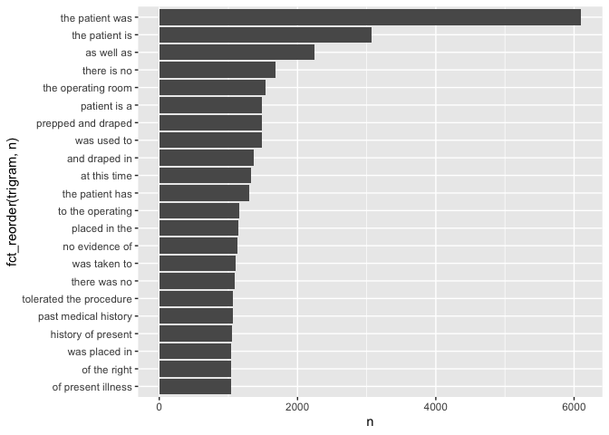

First, download the data.


```r
fn <- "mtsamples.csv"
if (!file.exists(fn))
  download.file("https://raw.githubusercontent.com/USCbiostats/data-science-data/master/00_mtsamples/mtsamples.csv", destfile = fn)

mtsamples<-read.csv(fn)
mtsamples<-as_tibble(mtsamples)
```

### Question 1: What specialties do we have?

We can use count() from dplyr to figure out how many different categories do we have? Are these categories related? overlapping? evenly distributed?


```r
specialties <- mtsamples %>%
  count(medical_specialty, sort = TRUE)
```

There are 40 specialties. Let's take a look at the distributions.


```r
ggplot(mtsamples, aes(x = medical_specialty)) +
  geom_histogram(stat = "count") +
  coord_flip()
```

```
## Warning: Ignoring unknown parameters: binwidth, bins, pad
```

<!-- -->

```r
specialties %>%
  arrange(desc(n)) %>%
  top_n(n, 15) %>%
  knitr::kable()
```

```
## Warning in if (n > 0) {: the condition has length > 1 and only the first element
## will be used
```


|medical_specialty             |    n|
|:-----------------------------|----:|
|Surgery                       | 1103|
|Consult - History and Phy.    |  516|
|Cardiovascular / Pulmonary    |  372|
|Orthopedic                    |  355|
|Radiology                     |  273|
|General Medicine              |  259|
|Gastroenterology              |  230|
|Neurology                     |  223|
|SOAP / Chart / Progress Notes |  166|
|Obstetrics / Gynecology       |  160|
|Urology                       |  158|
|Discharge Summary             |  108|
|ENT - Otolaryngology          |   98|
|Neurosurgery                  |   94|
|Hematology - Oncology         |   90|
|Ophthalmology                 |   83|
|Nephrology                    |   81|
|Emergency Room Reports        |   75|
|Pediatrics - Neonatal         |   70|
|Pain Management               |   62|
|Psychiatry / Psychology       |   53|
|Office Notes                  |   51|
|Podiatry                      |   47|
|Dermatology                   |   29|
|Cosmetic / Plastic Surgery    |   27|
|Dentistry                     |   27|
|Letters                       |   23|
|Physical Medicine - Rehab     |   21|
|Sleep Medicine                |   20|
|Endocrinology                 |   19|
|Bariatrics                    |   18|
|IME-QME-Work Comp etc.        |   16|
|Chiropractic                  |   14|
|Diets and Nutritions          |   10|
|Rheumatology                  |   10|
|Speech - Language             |    9|
|Autopsy                       |    8|
|Lab Medicine - Pathology      |    8|
|Allergy / Immunology          |    7|
|Hospice - Palliative Care     |    6|


```r
ggplot(specialties, aes(x = n, y = fct_reorder(medical_specialty,n))) +
  geom_col()
```

<!-- -->

These are not evenly (uniformly) distributed.

### Question 2

Tokenize the the words in the transcription column

Count the number of times each token appears

Visualize the top 20 most frequent words

Explain what we see from this result. Does it makes sense? What insights (if any) do we get?


```r
mtsamples %>%
  unnest_tokens(output = word, input = transcription) %>%
  count(word, sort = TRUE) %>%
  top_n(20) %>%
  ggplot(aes(x = n, y = fct_reorder(word,n))) +
    geom_col()
```

```
## Selecting by n
```

<!-- -->

The word "patient" seems to be important (duh!), but we observe a lot of stopwords.

### Question 3

What do we see know that we have removed stop words? Does it give us a better idea of what the text is about?


```r
# Redo visualization but remove stopwords before
mtsamples %>%
  unnest_tokens(output = word, input = transcription) %>%
  count(word, sort = TRUE) %>%
  anti_join(stop_words, by = "word") %>%
  # using regular expressions to remove numbers
  filter(!grepl(pattern = "^[0-9]+$", x = word)) %>%
  top_n(20) %>%
  ggplot(aes(x = n, y = fct_reorder(word,n))) +
    geom_col()
```

```
## Selecting by n
```

<!-- -->

### Question 4

repeat question 2, but this time tokenize into bi-grams. how does the result change if you look at tri-grams?


```r
mtsamples %>%
  unnest_ngrams(output = bigram, input = transcription, n = 2) %>%
  count(bigram, sort = TRUE) %>%
  top_n(20) %>%
  ggplot(aes(x = n, y = fct_reorder(bigram,n))) +
    geom_col()
```

```
## Selecting by n
```

<!-- -->

Using bi-grams is not very informative, let's try tri-grams.


```r
mtsamples %>%
  unnest_ngrams(output = trigram, input = transcription, n = 3) %>%
  count(trigram, sort = TRUE) %>%
  top_n(20) %>%
  ggplot(aes(x = n, y = fct_reorder(trigram,n))) +
    geom_col()
```

```
## Selecting by n
```

<!-- -->

Now some phrases start to show up, e.g. "tolerated the procedure", "prepped and draped".

### Question 5

Using the results you got from questions 4. Pick a word and count the words that appears after and before it.


```r
# use background, and see the distributions
```


### Question 6

Which words are most used in each of the specialties. you can use group_by() and top_n() from dplyr to have the calculations be done within each specialty. Remember to remove stopwords. How about the most 5 used words?


### Question 7 - extra

Find your own insight in the data:

Ideas:

Interesting ngrams
See if certain words are used more in some specialties then others


